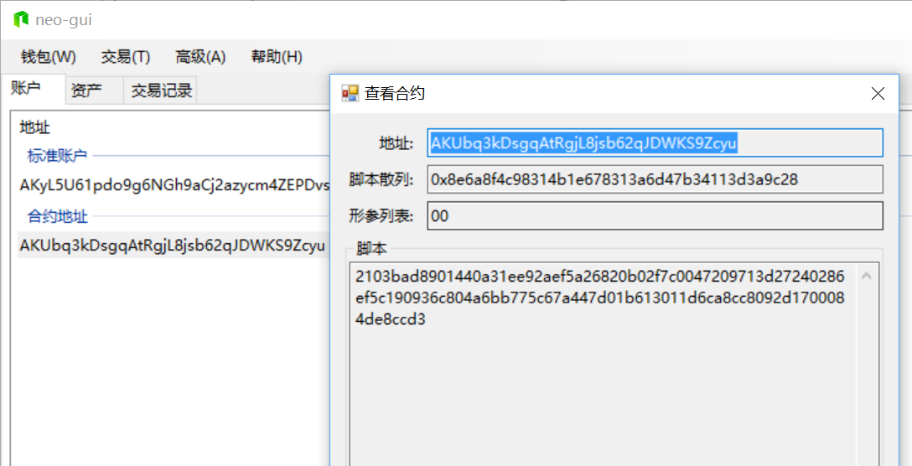
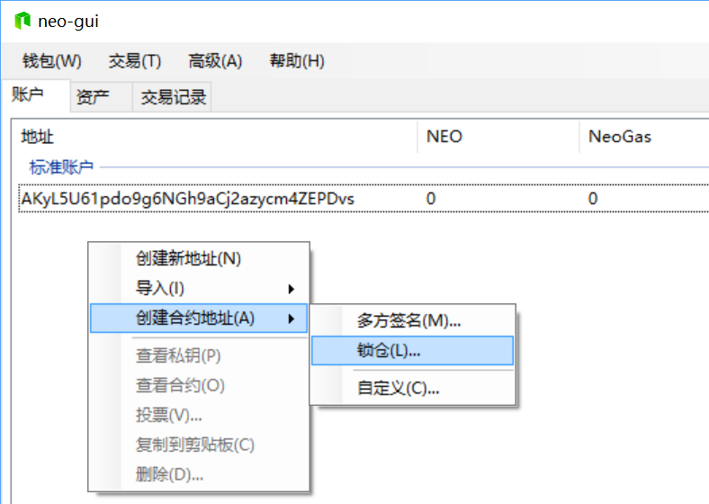
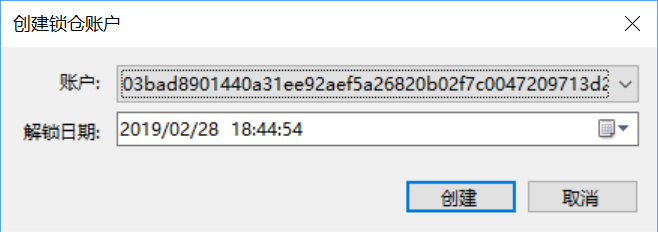
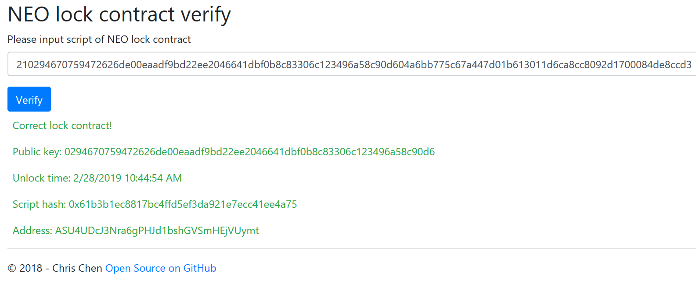

# NEO 锁仓合约使用说明

如果你想在 NEO 区块链上给其它人发送一笔资产，并且约定一个解锁时间，在解锁时间前对方是不能动用该资产的，解锁时间到达后，对方可以自由转让该资产。

我们该如何操作呢？

**接收方:**

首先你需要使用 [neo-gui](https://neo.org/download) 创建一个锁仓合约，然后将合约地址及合约脚本发送给发送方。

1. 打开 neo-gui 然后 创建/打开 一个钱包。

2. 右击空白外，`创建合约地址(A)` `锁仓(L)...`

   

3. 选择你的账户和解锁日期，然后点击 `创建`.

   

4. 现在，你可以看到在你的账户中多了一个合约地址，右击这个地址，点击， `查看合约`，然后将地址和脚本发送给发送方。

   

**发送方:**

1. 打开 http://lockverify.azurewebsites.net/ 在文本框中粘贴对方发来的合约脚本.

2. 点击 `Verify`

   

3. 如何合约脚本**不正确**，这里会提示错误。

4. 如果该合约是标准的锁仓合约，在这里可以看到解锁日期以及合约地址。

5. 比较该合约地址与接收方发给你的合约地址是否相同。

一切就绪后，发送方就可以将资产发送到该锁仓地址了。在解锁日期之前，该地址中的任何资产（NEO，GAS，以及其它资产）均不能进行转账操作。解锁日期后，接收方可以自由对资产进行转账。

